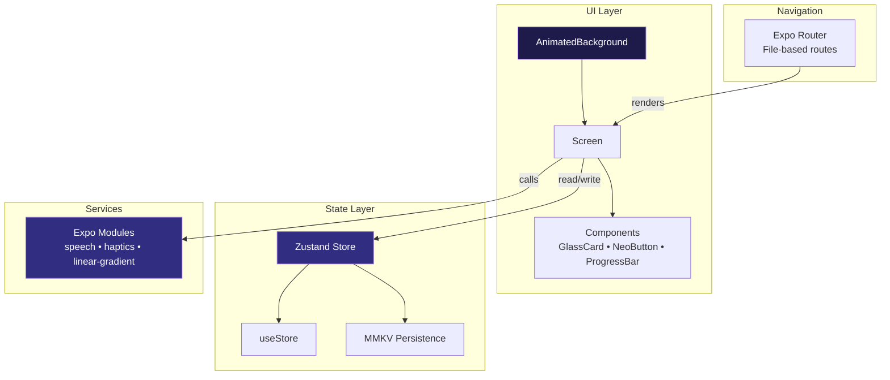
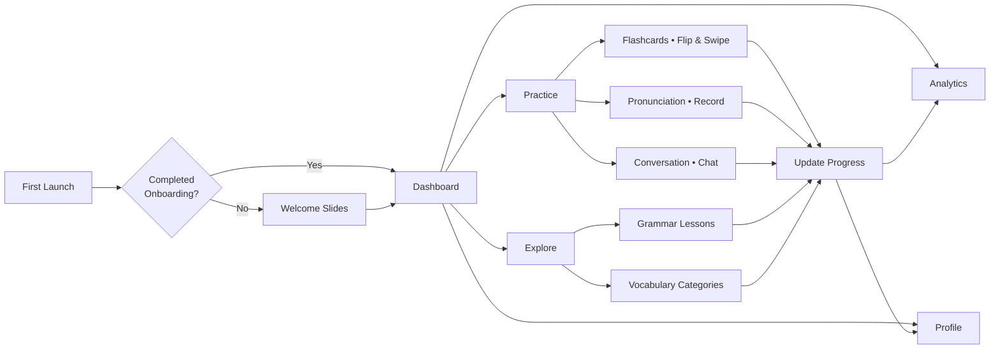

# Fluent English

**Where sophistication meets mastery.**  
Crafted for those who seek fluency with style. Fluent English combines a meticulously designed UI with intelligent learning workflows to elevate your English journey.

<div align="center">
  <svg xmlns="http://www.w3.org/2000/svg" viewBox="0 0 200 200" width="160" height="160" style="filter: drop-shadow(0 8px 16px rgba(99,102,241,0.3));">
    <defs>
      <radialGradient id="bg" cx="50%" cy="50%" r="70%">
        <stop offset="0%" stop-color="#6366F1" stop-opacity="0.4"/>
        <stop offset="100%" stop-color="#0F0F23" stop-opacity="1"/>
      </radialGradient>
      <filter id="glassBlur" x="-50%" y="-50%" width="200%" height="200%">
        <feGaussianBlur in="SourceGraphic" stdDeviation="8"/>
      </filter>
      <linearGradient id="shimmer" x1="0%" y1="0%" x2="100%" y2="100%">
        <stop offset="0%" stop-color="#fff" stop-opacity="0.25"/>
        <stop offset="50%" stop-color="#fff" stop-opacity="0.05"/>
        <stop offset="100%" stop-color="#fff" stop-opacity="0.15"/>
      </linearGradient>
    </defs>
    <circle cx="100" cy="100" r="90" fill="url(#bg)"/>
    <g transform="translate(60, 50)">
      <path d="M30 80 C30 95 40 100 55 100 L45 100 C38 100 30 92 30 80 Z" fill="rgba(99,102,241,0.25)" stroke="#8B5CF6" stroke-width="2"/>
      <path d="M30 80 L30 100 L55 100" fill="none" stroke="#8B5CF6" stroke-width="2"/>
      <path d="M20 60 Q10 50 25 45 Q40 35 55 45 Q70 55 60 70 Q65 85 50 90 L30 85 Q15 85 20 60 Z" fill="rgba(245,158,11,0.25)" stroke="#F59E0B" stroke-width="2"/>
      <circle cx="42" cy="58" r="4" fill="#F59E0B"/>
    </g>
    <circle cx="100" cy="100" r="85" fill="url(#shimmer)" filter="url(#glassBlur)"/>
  </svg>
  <p><i>Glass‑morphic emblem • Hand‑crafted vector</i></p>
</div>

---

## 📖 Table of Contents

- [✨ Highlights](#-highlights)
- [🖼 Visual Identity](#-visual-identity)
- [🏛 Architecture](#-architecture)
- [🧩 Feature Gallery](#-feature-gallery)
- [🎨 Design System](#-design-system)
- [🔧 Tech Stack](#-tech-stack)
- [🚀 Quick Start](#-quick-start)
- [📐 Type Safety](#-type-safety)
- [🧠 State Management](#-state-management)
- [🗺 User Journey](#-user-journey)
- [🤝 Contribute](#-contribute)

---

## ✨ Highlights

- **3D Flip Flashcards** – Spaced repetition with buttery‑smooth flips and swipe gestures  
- **Pronunciation Studio** – Record, analyze, and get instant feedback on your accent  
- **Grammar Atelier** – Bite‑sized lessons with curated examples  
- **Vocabulary Cabinet** – Categorized collections with quick‑review carousels  
- **Conversation Sim** – Real‑world dialogue practice with an AI tutor  
- **Insights Dashboard** – Minimalist charts for XP, streaks, and category mastery  
- **Premium UX** – Mesh gradients, glass cards, spring animations, haptic touch  

---

## 🖼 Visual Identity

### Logo concept

The emblem fuses a **speech bubble** (communication) with a **book** (learning) inside a deep‑space orb. Rendered in vector for crisp scaling.

<div align="center">
  <svg xmlns="http://www.w3.org/2000/svg" viewBox="0 0 200 200" width="200" height="200" style="filter: drop-shadow(0 12px 24px rgba(99,102,241,0.3));">
    <defs>
      <radialGradient id="bg2" cx="50%" cy="50%" r="70%">
        <stop offset="0%" stop-color="#6366F1" stop-opacity="0.4"/>
        <stop offset="100%" stop-color="#0F0F23" stop-opacity="1"/>
      </radialGradient>
      <filter id="glassBlur2" x="-50%" y="-50%" width="200%" height="200%">
        <feGaussianBlur in="SourceGraphic" stdDeviation="8"/>
      </filter>
      <linearGradient id="shimmer2" x1="0%" y1="0%" x2="100%" y2="100%">
        <stop offset="0%" stop-color="#fff" stop-opacity="0.25"/>
        <stop offset="50%" stop-color="#fff" stop-opacity="0.05"/>
        <stop offset="100%" stop-color="#fff" stop-opacity="0.15"/>
      </linearGradient>
    </defs>
    <circle cx="100" cy="100" r="90" fill="url(#bg2)"/>
    <g transform="translate(60, 50)">
      <path d="M30 80 C30 95 40 100 55 100 L45 100 C38 100 30 92 30 80 Z" fill="rgba(99,102,241,0.25)" stroke="#8B5CF6" stroke-width="2"/>
      <path d="M30 80 L30 100 L55 100" fill="none" stroke="#8B5CF6" stroke-width="2"/>
      <path d="M20 60 Q10 50 25 45 Q40 35 55 45 Q70 55 60 70 Q65 85 50 90 L30 85 Q15 85 20 60 Z" fill="rgba(245,158,11,0.25)" stroke="#F59E0B" stroke-width="2"/>
      <circle cx="42" cy="58" r="4" fill="#F59E0B"/>
    </g>
    <circle cx="100" cy="100" r="85" fill="url(#shimmer2)" filter="url(#glassBlur2)"/>
  </svg>
  <p>Fig 1. Logomark – a glass‑morphic gradient orb with stylized letterform</p>
</div>

### Color language

| Role | Palette | Usage |
|------|---------|-------|
| Background | `#030305` (void black) | Canvas |
| Surface | `rgba(26,26,46,0.4)` | Cards, containers |
| Primary | `#6366F1` → `#8B5CF6` | Buttons, accents |
| Accent | `#F59E0B` | Highlights, CTAs |
| Success | `#10B981` → `#34D399` | Progress, mastery |
| Text Primary | `#F8FAFC` | Headlines |
| Text Secondary | `#94A3B8` | Body copy |
| Border | `rgba(255,255,255,0.08)` | Dividers |

All colors are exposed as **readonly tuples** in `Theme` for gradient fidelity.

---

## 🏛 Architecture

A modular, unidirectional data flow with a single source of truth.



**Principles**

- Each screen is a pure function of `useStore` state  
- UI components are reusable, styled via a central `Theme`  
- Navigation is declarative (Expo Router) with deep‑link routes  
- All heavy lifting (speech, haptics) is abstracted into composable hooks

---

## 🧩 Feature Gallery

### Flashcards with 3D flip

<div align="center">
  <svg viewBox="0 0 400 240" width="640" height="384" style="background: radial-gradient(circle at 30% 30%, #1a1a2e 0%, #030305 60%); border-radius: 16px;">
    <defs>
      <linearGradient id="cardGrad" x1="0%" y1="0%" x2="100%" y2="100%">
        <stop offset="0%" stop-color="#6366F1"/>
        <stop offset="100%" stop-color="#8B5CF6"/>
      </linearGradient>
      <filter id="glow"><feDropShadow dx="0" dy="8" stdDeviation="16" flood-color="#6366F1" flood-opacity="0.4"/></filter>
    </defs>
    <!-- Card back -->
    <rect x="120" y="40" width="160" height="200" rx="24" fill="rgba(99,102,241,0.25)" filter="url(#glow)"/>
    <!-- Card front -->
    <rect x="130" y="50" width="160" height="200" rx="24" fill="url(#cardGrad)" transform="rotate(-5 210 150)"/>
    <text x="200" y="120" text-anchor="middle" fill="#fff" font-family="Inter" font-size="24" font-weight="700">Hello</text>
    <text x="200" y="150" text-anchor="middle" fill="rgba(255,255,255,0.7)" font-family="Inter" font-size="14">/həˈloʊ/</text>
    <text x="200" y="200" text-anchor="middle" fill="rgba(255,255,255,0.9)" font-family="Inter" font-size="16">Tap to flip</text>
  </svg>
  <p>Fig 2. Flashcard with gradient face, haptic flip, and swipe actions</p>
</div>

### Pronunciation studio

Users record a sentence, receive a score, and see a transcript with accuracy hints. Powered by `expo-speech-recognition` and custom scoring logic.

### Grammar lessons

Each lesson presents rules, examples, and an XP reward. Completion updates the progress ring and unlocks achievements.

---

## 🎨 Design System

Our style guide enforces consistency through TypeScript.

### Typography

| Token | Size | Weight | Line |
|-------|------|--------|------|
| heading1 | 32 px | 800 | 40 |
| heading2 | 28 px | 700 | 36 |
| body | 16 px | 400 | 24 |
| caption | 13 px | 500 | 18 |

All declared with `as const` to prevent implicit `any`.

### Spacing & Radius

```ts
spacing = { xs: 4, sm: 8, md: 16, lg: 24, xl: 32, xxl: 48, huge: 64, hugePlus: 80 }
borderRadius = { sm: 8, md: 12, lg: 16, xl: 20, xxl: 24, xxxl: 32, full: 9999 }
```

### Shadows

Unified elevation system:

```ts
shadows = {
  sm: { shadowOpacity: 0.15, shadowRadius: 8, elevation: 4 },
  md: { shadowOpacity: 0.2,  shadowRadius: 12, elevation: 8 },
  lg: { shadowOpacity: 0.25, shadowRadius: 24, elevation: 12 },
  glow: { shadowColor: '#6366F1', shadowOpacity: 0.3, shadowRadius: 20, elevation: 6 }
} as const
```

---

## 🔧 Tech Stack

| Layer | Tools |
|-------|-------|
| Framework | React Native, Expo SDK |
| Language | TypeScript (strict mode) |
| Navigation | Expo Router (file‑based) |
| State | Zustand + MMKV |
| UI | Linear Gradient, Pressable, Animated |
| Animations | React Native Reanimated (springs) |
| Speech | `expo-speech`, `expo-speech-recognition` |
| Icons/Graphics | Custom SVG + vector icons |

---

## 🚀 Quick Start

```bash
# 1. Clone and install
git clone https://github.com/ranker-002/fluent-english.git
cd fluent-english
npm ci

# 2. Start development server
npx expo start

# 3. Open on device (Expo Go)
#    – Android: scan QR
#    – iOS: scan with Camera app
```

**Note:** For native builds, run `npx expo prebuild` then `npx expo run:android` or `npx expo run:ios`.

---

## 📐 Type Safety

Strict TypeScript is enforced. All style objects use `StyleSheet.create({...} as const)`, and theme literals are `readonly` to guarantee gradient tuple shapes.

```bash
npx tsc --noEmit   # must produce zero errors
```

All `fontWeight` values are cast to `'600' as const`, `'700' as const`, etc., so React Native receives valid `FontWeight` literals.

---

## 🧠 State Management

Central store in `store/useStore.ts` (Zustand) persists via MMKV.

Key slices:

```ts
interface Store {
  lessons: Lesson[];           // id, title, duration, xp, completed
  flashcards: FlashCard[];    // spaced repetition fields
  grammarLessons: GrammarLesson[];
  vocabularyCategories: VocabularyCategory[];
  achievements: Achievement[];
  progress: UserProgress;     // xp, level, streak, etc.
  settings: AppSettings;      // notifications, sound, haptics, dailyGoal
  actions: { completeFlashcard; skipFlashcard; addXP; ... }
}
```

Derived data (streaks, category counts) are computed in selectors.

---

## 🗺 User Journey



---

## 🤝 Contribute

We welcome craftsmanship. If you’re passionate about beautiful, type‑safe React Native apps:

1. Fork the repo  
2. Create a branch (`feat/your-feature`)  
3. Make your changes, respecting the design system and type rules  
4. Ensure `npx tsc --noEmit` is clean  
5. Open a PR with a clear description and before/after screenshots if UI‑related  

---

## 📄 License

MIT © 2026 Fluent English

<p align="center">
  <strong>Designed with precision. Built for fluency.</strong>
</p>
