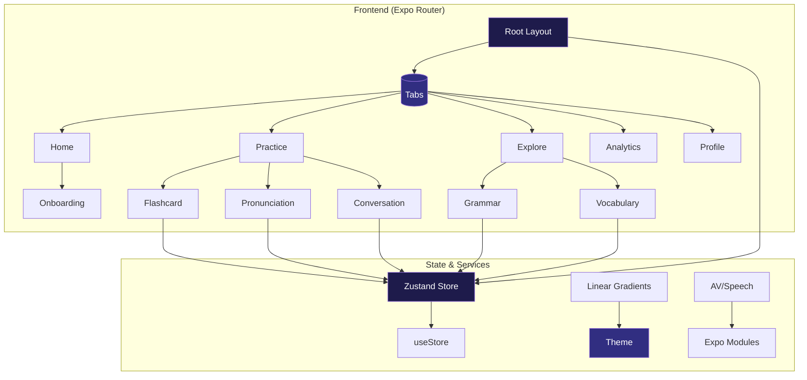
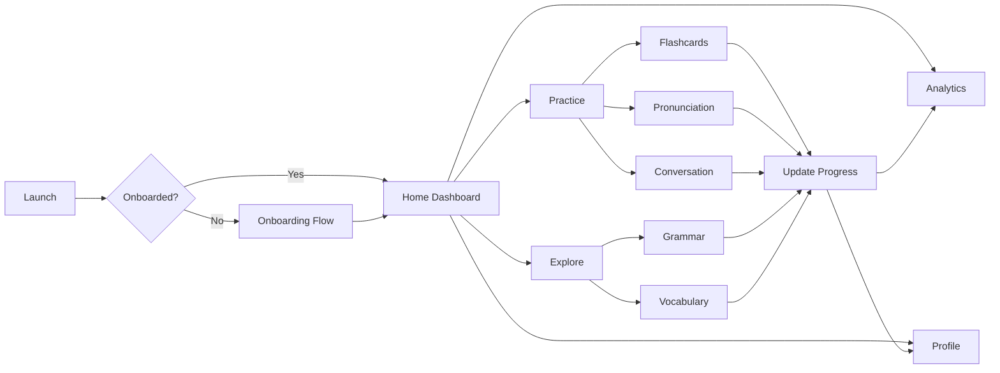

# Fluent English

**Master English with elegance.** Fluent English is a premium, immersive language learning experience built with React Native and Expo. Featuring smart flashcards, pronunciation coaching, grammar lessons, and real-time progress analytics — all wrapped in a stunning glass-morphic UI.

<p align="center">
  
</p>

---

## ✨ Features

- **Flashcards** – Spaced repetition with smooth 3D flip and swipe gestures  
- **Pronunciation** – Voice recording + feedback to fine-tune your accent  
- **Grammar Lessons** – Structured topics with examples and quick checks  
- **Vocabulary** – Categorized word banks with quick review carousels  
- **Conversations** – Simulated real-world dialogues with AI assistant  
- **Analytics** – Beautiful charts showing XP, streaks, and category breakdown  
- **Design** – Deep space theme, animated mesh gradients, glassmorphism, and haptic feedback  

---

## 🏗 Architecture

Fluent English follows a clean, modular architecture with a centralized state store and reusable UI components.



---

## 📂 Project Structure

```
fluent-english/
├── app/                    # Expo Router screens
│   ├── (tabs)/            # Tab navigator screens
│   │   ├── index.tsx      # Home dashboard
│   │   ├── practice.tsx   # Quick actions + goals
│   │   ├── explore.tsx    # Grammar + vocabulary
│   │   ├── analytics.tsx  # Progress charts
│   │   ├── profile.tsx    # User profile
│   │   └── _layout.tsx    # Tab bar layout
│   ├── learning/
│   │   ├── index.tsx      # Lesson list
│   │   └── flashcard.tsx  # Card study with flip
│   ├── vocabulary/
│   │   ├── index.tsx      # Categories grid
│   │   └── word/[id].tsx  # Word detail view
│   ├── grammar/
│   │   ├── index.tsx      # Lesson list
│   │   └── [id].tsx       # Lesson content
│   ├── pronunciation/
│   │   └── index.tsx      # Recording + scoring
│   ├── conversation/
│   │   └── index.tsx      # Chat simulation
│   ├── achievements/
│   │   └── index.tsx      # Badges gallery
│   ├── settings/
│   │   └── index.tsx      # Preferences
│   ├── onboarding/
│   │   └── index.tsx      # Welcome flow
│   ├── index.tsx          # Entry redirect
│   └── _layout.tsx        # Root layout
├── components/
│   ├── ui/
│   │   ├── GlassCard.tsx      # Frosted glass container
│   │   ├── NeoButton.tsx      # Gradient pressable button
│   │   └── ProgressBar.tsx    # Animated progress bar
│   ├── effects/
│   │   └── AnimatedBackground.tsx  # Mesh gradient + orbs
│   └── ErrorBoundary.tsx
├── store/
│   └── useStore.ts        # Zustand state (lessons, progress, settings)
├── theme.ts               # Design tokens (colors, typography, spacing)
├── tsconfig.json          # TypeScript configuration
└── assets/                # Images, icons, fonts
```

---

## 🎨 Design System

All styles use TypeScript strict mode with `as const` assertions for type safety. The theme is centralized in `theme.ts`:

```typescript
export const Theme = {
  colors: {
    background: '#030305',
    surface: 'rgba(26, 26, 46, 0.4)',
    primary: '#6366F1',
    accent: '#F59E0B',
    // …
  } as const,
  typography: {
    heading1: { fontSize: 32, fontWeight: '800' } as const,
    // …
  } as const,
  gradients: {
    primary: ['#6366F1', '#8B5CF6'] as const,
    // …
  } as const,
  shadows: { /* … */ } as const,
  borderRadius: { /* … */ } as const,
  spacing: { /* … */ } as const,
};
```

Key visual ingredients:
- **Deep space palette** – dark backgrounds with vibrant indigo & amber accents  
- **Glassmorphism** – translucent cards with subtle borders and glow  
- **Mesh gradients** – animated moving orbs for depth  
- **Haptics** – light impact on button presses  

---

## 🛠 Tech Stack

| Layer | Technology |
|-------|------------|
| Framework | React Native ( Expo SDK ) |
| Language | TypeScript (strict) |
| Navigation | Expo Router (file-based) |
| State | Zustand + MMKV persistence |
| UI | React Native + Linear Gradient |
| Animation | Reanimated (springs) |
| Speech | expo-speech, expo-speech-recognition |
| Storage | react-native-mmkv |

---

## 🚀 Getting Started

### Prerequisites
- Node.js 18+
- Expo Go app (iOS/Android) or Android Studio / Xcode
- Git

### Install & Run

```bash
# Clone repository
git clone https://github.com/ranker-002/fluent-english.git
cd fluent-english

# Install dependencies
npm install

# Start development server
npx expo start

# Scan QR with Expo Go (Android) or Camera app (iOS)
```

### Build for Production

```bash
# Prebuild native projects (if needed)
npx expo prebuild

# Build standalone app (Android example)
npx expo run:android --variant release
```

---

## 🧪 Type Checking

The project uses strict TypeScript. Run:

```bash
npx tsc --noEmit
```

Should return **zero errors**.

---

## 📈 State Management

Global state lives in `store/useStore.ts` (Zustand). Main slices:

- `lessons` – list of regular lessons with completion + XP  
- `flashcards` – vocabulary cards with spaced repetition fields  
- `grammarLessons` – grammar units with examples  
- `vocabularyCategories` – grouped word lists  
- `achievements` – unlockable badges  
- `progress` – aggregated stats (XP, streak, level)  
- `settings` – notifications, sound, haptics, daily goal  

Persisted automatically via MMKV.

---

## 🎯 User Journey



---

## 🤝 Contributing

Contributions are welcome! Please:

1. Fork the repository  
2. Create a feature branch (`feat/your-feature`)  
3. Follow the existing TypeScript + design conventions  
4. Ensure `npx tsc --noEmit` passes  
5. Submit a PR with a clear description  

---

## 📄 License

MIT © 2026 Fluent English

---

<p align="center">
  Built with ❤️ and ☕ by the Fluent English team
</p>
